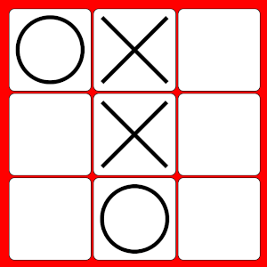
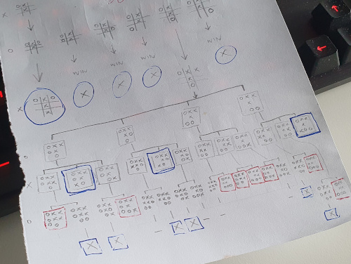

# Tic-Tac-Toe against AI

https://lysebo.xyz/games/ttt



Tic-Tac-Toe is a board game for two players, with pieces `X` and `O`.
The players place one piece on the board at a time, and whoever gets a
straight line with 3 pieces wins.
The line can be either orthogonal or diagonal.

In this game you have an AI opponent, created using a personal variation of
the Min-Max tree search algorithm.

Developed in July 2023


# Min-Max Decision Tree Generator

Selecting the best move involves knowing all possible moves and outcomes
from the current state of the board, and choosing the path that has
the highest probability of winning.

Even in a tiny game such as this, all possible combinations of starting player
and series of moves adds up to 1,972,819 boards. This can be massively
reduced, for instance:
1. A lot of different combinations end up with the same looking board.
We don't need to store duplicates.
2. Wins and losses cut off the need for further examination.
3. We don't need to generate two parallel structures - one to help player `X`
win and another to help player `O` win. These structures are completely
identical, only with opposite goals.
4. Even more boards can be removed due to symmetry and rotation. There are
really only 3 positions in which to place the starting piece: in the corner, along the
border or in the center.

Points 1-3 are implemented this time, reducing the number of nodes to 5,478.
This gives us a complete overview of all moves and outcomes of the game.
It doesn't take too long to generate, and if stored in a compact way we can
include this in the game code, making the computer player perform very fast.

In more complex games such as connect-four or chess, the decision-making
process should be performed in realtime, with either a time restraint or a
limit on how many levels down the computer can go.

The Min-Max tree search algorithm is ideal for a two-player turn-based
board game.

The following illustrates a branch of possible moves from a given board
somewhere in the game. All moves that result in either win, loss or draw stops
further branching. Finished nodes are marked MAX (player `X` wins), MIN (player
`O` wins) or DRW (it's a draw).

Players `X` and `O` take turns for each level.

```
X:                                                                       
   OXX                                                                   
   .X.                                                                   
   O..                                                                   
   |________________________________________________________________     
   |                   |                             |              |    
O: |                   |                             |              MIN  
   OXX                 OXX                           OXX            OXX  
   .XO                 .X.                           .X.            OX.  
   O..                 OO.                           O.O            O..  
   |______________     |___________________          |______________     
   |         |    |    |         |         |         |         |    |    
X: |         |    MAX  |         |         |         |         |    MAX  
   OXX       OXX  OXX  OXX       OXX       OXX       OXX       OXX  OXX  
   XXO       .XO  .XO  XX.       .XX       .X.       XX.       .XX  .X.  
   O..       O.X  OX.  OO.       OO.       OOX       O.O       O.O  OXO  
   |____     |____     |____     |____     |____     |____     |____     
   |    |    |    |    |    |    |    |    |    |    |    |    |    |    
O: |    |    MIN  |    |    MIN  MIN  MIN  MIN  |    |    MIN  MIN  MIN  
   OXX  OXX  OXX  OXX  OXX  OXX  OXX  OXX  OXX  OXX  OXX  OXX  OXX  OXX  
   XXO  XXO  OXO  .XO  XXO  XX.  OXX  .XX  OX.  .XO  XXO  XX.  OXX  .XX  
   OO.  O.O  O.X  OOX  OO.  OOO  OO.  OOO  OOX  OOX  O.O  OOO  O.O  OOO  
   |    |         |    |                        |    |                   
   |    |         |    |                        |    |                   
X: DRW  MAX       DRW  DRW                      DRW  MAX                 
   OXX  OXX       OXX  OXX                      OXX  OXX                 
   XXO  XXO       XXO  XXO                      XXO  XXO                 
   OOX  OXO       OOX  OOX                      OOX  OXO                 
```

Removing the boards to see the tree structure more clearly:

```
X:                                                                       
   OXX                                                                   
   .X.                                                                   
   O..                                                                   
   |________________________________________________________________     
   |                   |                             |              |    
O: |                   |                             |              MIN  
   |______________     |___________________          |______________     
   |         |    |    |         |         |         |         |    |    
X: |         |    MAX  |         |         |         |         |    MAX  
   |____     |____     |____     |____     |____     |____     |____     
   |    |    |    |    |    |    |    |    |    |    |    |    |    |    
O: |    |    MIN  |    |    MIN  MIN  MIN  MIN  |    |    MIN  MIN  MIN  
   |    |         |    |                        |    |                   
   |    |         |    |                        |    |                   
X: DRW  MAX       DRW  DRW                      DRW  MAX                 
```

All finished nodes are given an initial score.
- MAX = 100 points
- MIN = -100 points
- DRW = 0 points

The nodes without a score gets the sum of its immediate children, all the way
to the top. But not before we've added a critical adjustment.

To be able to choose the quickest (safest) way to win, the early/shallow wins
and losses must have a substantial higher amplitude than the wins and losses
further down in the tree structure

MAX and MIN nodes need to be adjusted with a level-specific multiplier that is
gradually diminished as the levels get deeper and deeper.
This is to prevent the shallow-leveled wins must not be overtaken by
accumulated values from the deep.

After too much time debugging this, it seems fair to multiply the score with
a factor of 10 (9 tiles + 1) for each level upwards:
```
level 0: multiply by 1000000000
level 1: multiply by 100000000
level 2: multiply by 10000000
level 3: multiply by 1000000
level 4: multiply by 100000
level 5: multiply by 10000
level 6: multiply by 1000
level 7: multiply by 100
level 8: multiply by 10
level 9: multiply by 1
```

```
const levelMultiplier = [];
for(let i=0; i<=9; i++) {
  levelMultiplier.unshift(Math.pow(10,i));
}
```

Now, the finished nodes are given a score, and unfinised nodes get the sum of
its immediate children.

```
X:                                                                            
   OXX                                                                        
   .X.                                                                        
   O..                                                                        
   |______________________________________________________________________    
   |                    |                                |                |   
O: 9100               -4000                            7100            -100000
   OXX                  OXX                              OXX              OXX 
   .XO                  .X.                              .X.              OX. 
   O..                  OO.                              O.O              O.. 
   |_______________     |______________________          |________________    
   |         |     |    |          |           |         |          |     |   
X: 100     -1000 10000 -1000     -2000       -1000     -900       -2000 10000 
   |____     |_____     |____      |_____      |____     |____      |_____    
   |    |    |     |    |    |     |     |     |    |    |    |     |     |   
O: |    |  -1000   |    |  -1000 -1000 -1000 -1000  |    |  -1000 -1000 -1000 
   |    |          |    |                           |    |                    
   |    |          |    |                           |    |                    
X: 0    100        0    0                           0    100                  
```

In this case, player `O` will select the move that has the lowest possible
score, and win the game.


# Checking the board

A board is represented by a string with length 9.
During the node generation, pieces `X` and `O` are plotted onto the string.

Checking if a given board has a winner or loser is done by comparing patterns
from a `wins` or `losses` array. The `wins` array looks like this:

```
wins: [
   // horizontal wins
   "XXX......",
   "...XXX...",
   "......XXX", 

   // vertical wins
   "X..X..X..",
   ".X..X..X.",
   "..X..X..X",

   // diagonal wins
   "X...X...X",
   "..X.X.X.."
],
```

Each element in the array is converted to a Regular Expression and tested on the board.
As soon as we have a match, the function returns.
This is much more convenient than having hundreds of if statements.
It might not be as efficient CPU wise, but when this is pre generated it doesn't matter.


# Human Intervention Needed

Sometimes the algorithm selects a move that is not strategically best.
The selected move has the highest score, but the score calculation is too
simple. It doesn't rate or evaluate which wins are better than others,
apart from looking at the depth.

Some wins are indeed better than others. For instance check-mate
situations where you have more than one spot to place your winning piece.
The decision tree should try to reach these situations (MAX) or
avoid them (MIN).

The score assignment logic could be improved. But the easiest is
to manually adjust the scores for a few undesirable moves.

Step 4 in the following game is an udesirable move for player `O`
as it opens up for player `X` to win in multiple directions.

```
  1:         2:         3:         4:         5:   
  X _ _      X _ _      X _ _      X _ _      X _ X
  _ _ _  =>  _ O _  =>  _ O _  =>  _ O _  =>  _ O _
  _ _ _      _ _ _      _ _ X      O _ X      O _ X

```

A far better move is this, forcing player `X` to defend itself rather than
getting a check-mate. This will eventually end in a draw:

```
  1:         2:         3:         4:         5:   
  X _ _      X _ _      X _ _      X _ _      X _ _
  _ _ _  =>  _ O _  =>  _ O _  =>  _ O O  =>  X O O
  _ _ _      _ _ _      _ _ X      _ _ X      _ _ X

```


And another one! Step 3 will cause the game to end in a draw.

```
  1:         2:         3:         4:         5:         6:
  X _ _      X _ O      X _ O      X _ O      X _ O      X _ O
  _ _ _  =>  _ _ _  =>  _ X _  =>  _ X _  =>  _ X X  =>  O X X
  _ _ _      _ _ _      _ _ _      _ _ O      _ _ O      _ _ O

```

A smarter move for player `X` is this. Step 3 is a setup for
check-mate in step 5.

```
  1:         2:         3:         4:         5:   
  X _ _      X _ O      X _ O      X _ O      X _ O
  _ _ _  =>  _ _ _  =>  _ _ _  =>  O _ _  =>  O _ _
  _ _ _      _ _ _      X _ _      X _ _      X _ X

```

Due to symmetry we need to adjust the score on multiple nodes.


# Further improvements

After some human intervention I think it's impossible to beat the computer,
and this makes the game a bit boring to play.
A fun addition could be a slider for adjusting the smartness of the computer,
affecting the decision making.


# Work in progress

In loving memory of hours spent finding bugs in the score calculation logic <3

